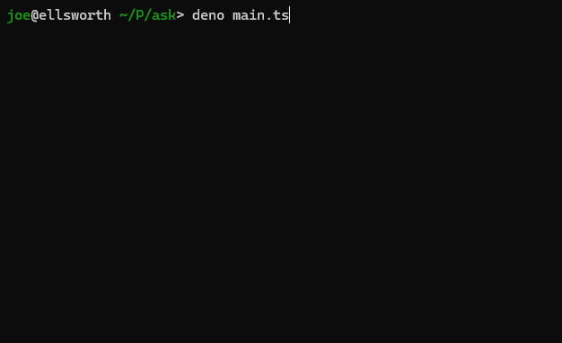

# ask

Interactive command-line prompts for Deno.



## Description

`ask` is a slick Deno module that allows you to create interactive command-line
applications, similar to what you'd achieve with
[inquirer](https://www.npmjs.com/package/inquirer) in Node.js.

## Overview

- **Supported prompts:**
  - `input` (plain text)
  - `number` (integer or float)
  - `password` (hidden/masked input)
  - `confirm` (yes/no)
  - `editor` (open an editor to write longer text)
  - `select` (pick one item from a list)
  - `checkbox` (pick multiple items from a list)
- Elegant output.
- Familiar, inquirer-like syntax.
- Easily configurable.
- Strong type-safety.

## Basic Usage

First, install the package from JSR:

```sh
deno add jsr:@sallai/ask
```

Then just create an `Ask` instance and use the `prompt()` method to enumerate
your questions.

```ts
import { Ask } from "@sallai/ask";

const ask = new Ask(); // global options are also supported!

const answers = await ask.prompt([
  {
    name: "name",
    type: "input",
    message: "Name:",
  },
  {
    name: "age",
    type: "number",
    message: "Age:",
  },
] as const);

console.log(answers); // { name: "Joe", age: 19 }
```

You can also just ask a single question:

```ts
const { name } = await ask.input({
  name: "name",
  message: "Name:",
} as const);

console.log(name); // Joe
```

> **Note:** The `as const` assertion is necessary to ensure that the `name`
> property is not widened to `string`. This is necessary for the type-checking
> to work properly.

## Documentation and API

Please visit the [JSR documentation page][docs] for more information on how to
use the library.

## License

MIT.

[docs]: https://jsr.io/@sallai/ask/doc
